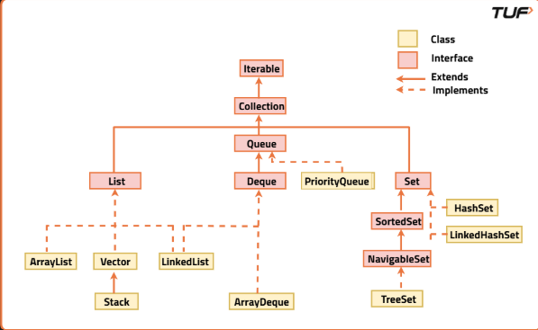

# Java Collections Framework (JCF)

When you start programming in Java, the first tool you probably use to store multiple values is an **array**. Arrays are easy to understand—they hold a fixed number of elements of the same type, and you can access them using an index.

However, arrays have one major limitation: **their size is fixed once they are created**. If you need to store more elements than the array's capacity, you must create a new array, copy all the existing elements into it, and then add the new ones. This process is tedious, inefficient, and error-prone.

Arrays also do not provide built-in methods for common operations such as:
- Searching
- Sorting
- Inserting elements
- Removing elements

This is where the **Java Collections Framework (JCF)** becomes useful.

---

## What is the Java Collections Framework?

The **Java Collections Framework (JCF)** is a part of the `java.util` package that provides ready-to-use classes and interfaces for storing and manipulating groups of objects.

### Advantages

- Dynamic size (can grow or shrink)
- Built-in methods for common operations
- Better performance than manually managing arrays
- Consistent API across all collection classes
- Easy to learn and use

---

## Java Collections Framework Hierarchy



---

# The Concept of a Framework

The Java Collections Framework is not just a random set of classes—it's an organized hierarchy.

At the top is the **Iterable** interface, which allows objects to be traversed using the enhanced **for-each loop**.

Next comes the **Collection** interface, which represents a group of objects and provides basic operations such as:

- `add()`
- `remove()`
- `contains()`
- `size()`
- `clear()`

The Collection interface is divided into three major branches:

- **List** → Ordered collection that allows duplicates.
- **Set** → Unordered collection that does not allow duplicates.
- **Queue** → Collection designed for processing elements in a specific order.

Apart from these, there is another important interface:

- **Map** → Stores data as **key-value pairs**. (Map is **not** a subtype of Collection.)

---

# List

A **List** is an ordered collection that:

- Maintains insertion order
- Allows duplicate elements
- Supports index-based access

### Common Implementations

### ArrayList
- Backed by a dynamic array
- Fast random access (`O(1)`)
- Slower insertion and deletion in the middle

### LinkedList
- Implemented using a doubly linked list
- Faster insertion and deletion
- Slower random access

### Vector
- Similar to ArrayList
- Thread-safe (synchronized)
- Considered legacy and rarely used in modern applications

---

# Set

A **Set** stores only **unique elements**.

It is commonly used for:

- Usernames
- IDs
- Unique values

### Common Implementations

### HashSet
- Uses hashing internally
- No guaranteed ordering
- Very fast insertion, deletion, and lookup

### LinkedHashSet
- Similar to HashSet
- Maintains insertion order

### TreeSet
- Stores elements in ascending sorted order
- Internally uses a Red-Black Tree
- Slower than HashSet but maintains sorting

---

# Map

Unlike other collection types, a **Map** stores data as **key-value pairs**.

Characteristics:

- Keys must be unique
- Values can be duplicated
- Provides very fast lookup using keys

### Common Implementations

### HashMap
- Fast lookups
- No ordering of keys

### LinkedHashMap
- Maintains insertion order

### TreeMap
- Stores keys in ascending sorted order
- Internally uses a Red-Black Tree

---

# Generics and Type Safety

One of the biggest advantages of the Collections Framework is **Generics**.

Generics provide:

- Compile-time type safety
- Better readability
- No manual type casting
- Prevention of inserting incorrect data types

### Example

```java
List<String> names = new ArrayList<>();

names.add("John");

// names.add(42); // Compile-time Error
```

---

# Collections Utility Class

The framework also provides a helper class called **Collections**.

It contains many useful static methods, such as:

- `sort()`
- `reverse()`
- `shuffle()`
- `min()`
- `max()`

### Example

```java
List<Integer> nums = Arrays.asList(3, 1, 4, 2);

Collections.sort(nums);
Collections.reverse(nums);
```

---

# Internal Working of Collections

### HashMap / HashSet
- Use **Hash Tables**
- Very fast insertion and lookup

### TreeMap / TreeSet
- Use **Red-Black Trees**
- Store elements in sorted order

### ArrayList
- Uses a **Resizable Array**
- Automatically increases capacity when needed

### LinkedList
- Uses a **Doubly Linked List**
- Each node stores:
  - Data
  - Reference to previous node
  - Reference to next node

---

# Summary
# 📋 Java Collections Framework - Quick Reference

| Interface / Family | Common Implementations | Order | Duplicates | Null Support | Typical Use Cases | Performance Notes | Key APIs |
|--------------------|------------------------|-------|------------|--------------|-------------------|-------------------|----------|
| **List** | ArrayList, LinkedList, Vector | Maintains insertion order; index-based access | ✅ Allowed | ✅ Yes (elements) | Indexed access, ordered data, stacks (Stack), queues (LinkedList) | **ArrayList:** O(1) get/add-end, O(n) insert/delete middle <br> **LinkedList:** O(1) add/remove ends, O(n) random access | `get()`, `set()`, `add()`, `remove()`, `indexOf()`, `subList()` |
| **Set** | HashSet, LinkedHashSet, TreeSet | **HashSet:** No order <br> **LinkedHashSet:** Insertion order <br> **TreeSet:** Sorted | ❌ Not Allowed | **HashSet/LinkedHashSet:** One `null` <br> **TreeSet:** No `null` | Unique elements, membership testing, de-duplication | **HashSet:** O(1) avg add/search <br> **TreeSet:** O(log n) add/search | `add()`, `contains()`, `remove()`, `iterator()` |
| **Queue / Deque** | ArrayDeque, LinkedList, PriorityQueue | **Queue:** FIFO <br> **Deque:** Both ends <br> **PriorityQueue:** Priority order | ✅ Allowed | **PriorityQueue:** No `null` | Task scheduling, BFS, buffering | **ArrayDeque:** O(1) add/remove ends <br> **PriorityQueue:** O(log n) add/remove | `offer()`, `poll()`, `peek()`, `addFirst()`, `pollLast()` |
| **Map** | HashMap, LinkedHashMap, TreeMap | **HashMap:** No order <br> **LinkedHashMap:** Insertion order <br> **TreeMap:** Sorted by keys | Keys unique, Values can duplicate | **HashMap:** One `null` key, many `null` values <br> **TreeMap:** No `null` key | Fast lookup, indexing, frequency counting | **HashMap:** O(1) avg get/put <br> **TreeMap:** O(log n) get/put | `put()`, `get()`, `containsKey()`, `remove()`, `keySet()`, `values()`, `entrySet()` |
| **Concurrent Collections** | ConcurrentHashMap, CopyOnWriteArrayList, ConcurrentLinkedQueue | Depends on implementation | Depends on implementation | Usually disallows `null` | Multi-threaded applications | Better throughput than synchronized collections | Concurrent APIs |
| **Utility Classes** | Collections, Arrays | — | — | — | Sorting, reversing, shuffling, searching | Utility/helper methods | `sort()`, `reverse()`, `shuffle()`, `binarySearch()`, `fill()`, `copy()` |

---

# 🚀 Common Time Complexities

| Collection | Search | Insert | Delete |
|------------|--------|--------|--------|
| ArrayList | O(1) (index) / O(n) (value) | O(1) end, O(n) middle | O(n) |
| LinkedList | O(n) | O(1) (known position) | O(1) (known position) |
| HashSet | O(1) avg | O(1) avg | O(1) avg |
| TreeSet | O(log n) | O(log n) | O(log n) |
| HashMap | O(1) avg | O(1) avg | O(1) avg |
| TreeMap | O(log n) | O(log n) | O(log n) |
| PriorityQueue | O(n) search | O(log n) | O(log n) |

---

# 💡 Quick Selection Guide

| Requirement | Best Choice |
|-------------|-------------|
| Fast random access | ArrayList |
| Frequent insert/delete | LinkedList |
| Unique elements | HashSet |
| Unique + insertion order | LinkedHashSet |
| Sorted unique elements | TreeSet |
| FIFO operations | Queue / ArrayDeque |
| Priority-based processing | PriorityQueue |
| Fast key-value lookup | HashMap |
| Ordered key-value pairs | LinkedHashMap |
| Sorted keys | TreeMap |
| Thread-safe collections | ConcurrentHashMap / CopyOnWriteArrayList |

---

> **Interview Tip:**  
> - Use **ArrayList** by default unless frequent insertions/deletions are required.  
> - Use **HashMap** for fast lookups.  
> - Use **HashSet** when uniqueness matters.  
> - Use **TreeMap/TreeSet** when sorted data is required.  
> - Use **ArrayDeque** instead of **Stack** for stack operations in modern Java.


# Important Utility Classes

The Java Collections Framework provides two important utility classes that simplify working with collections and arrays.

---

## Collections Class

The **Collections** class is a utility class present in the `java.util` package. It contains static methods for performing common operations on collection objects.

### Common Methods

| Method | Description |
|---------|-------------|
| `sort()` | Sorts a list in ascending order |
| `reverse()` | Reverses the order of elements |
| `shuffle()` | Randomly shuffles elements |
| `binarySearch()` | Performs binary search on a sorted list |
| `min()` | Returns the minimum element |
| `max()` | Returns the maximum element |
| `frequency()` | Counts the occurrences of an element |
| `fill()` | Replaces all elements with a specified value |
| `copy()` | Copies elements from one list to another |
| `swap()` | Swaps two elements in a list |
| `rotate()` | Rotates elements in a list |
| `unmodifiableList()` | Creates a read-only list |
| `synchronizedList()` | Creates a thread-safe list |

### Example

```java
List<Integer> nums = Arrays.asList(5, 2, 8, 1);

Collections.sort(nums);
Collections.reverse(nums);
Collections.shuffle(nums);

System.out.println(nums);
```

---

## Arrays Class

The **Arrays** class is also part of the `java.util` package. It provides utility methods specifically for working with arrays.

### Common Methods

| Method | Description |
|---------|-------------|
| `sort()` | Sorts an array |
| `binarySearch()` | Searches an element in a sorted array |
| `fill()` | Fills an array with a specific value |
| `copyOf()` | Creates a copy of an array |
| `copyOfRange()` | Copies a specific range from an array |
| `equals()` | Checks whether two arrays are equal |
| `deepEquals()` | Compares multidimensional arrays |
| `toString()` | Converts an array to a string |
| `deepToString()` | Converts multidimensional arrays to a string |
| `asList()` | Converts an array into a List |

### Example

```java
int[] arr = {5, 3, 8, 1};

Arrays.sort(arr);

System.out.println(Arrays.toString(arr));
```

---

## Collections vs Arrays Utility Class

| Collections | Arrays |
|-------------|--------|
| Works with Collection objects (`List`, `Set`, `Queue`) | Works only with arrays |
| Contains methods like `sort()`, `shuffle()`, `reverse()` | Contains methods like `sort()`, `binarySearch()`, `copyOf()` |
| Part of `java.util.Collections` | Part of `java.util.Arrays` |

> **Interview Tip:**  
> - Use the **Collections** class when working with Java Collection objects (`ArrayList`, `LinkedList`, etc.).  
> - Use the **Arrays** class when working with Java arrays.